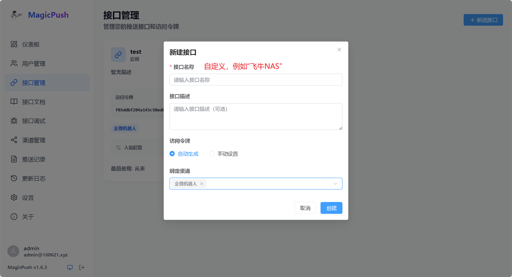
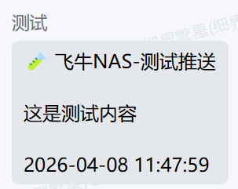

# 魔法推送

[← 推送渠道总览](../notification-channels.md) · [← README](../../README.md)

## 一、安装魔法推送

安装方式一：从飞牛应用商店安装


安装方式二：通过docker compose方式安装

```yml
services:
  magicpush:
    image: docker.cnb.cool/magiccode1412/magicpush:latest
    ports:
      - "818:3000"
    volumes:
      - ./data:/app/server/data
    network_mode: bridge
    container_name: magicpush
```

## 二、配置魔法推送

通过`飞牛控制台桌面图标`或者`nasip+端口`方式打开魔法推送

1. 注册

    首次注册，默认为管理员，之后用户注册功能默认关闭，有需要可以在设置页面手动打开

    

2. 添加推送渠道

    切换到`渠道推送`页面，添加一个或者多个渠道

    

3. 添加接口

    切换到`接口管理`页面，添加一个接口，一个接口可以同时绑定多个渠道，会得到一个`访问令牌`

    

4. 记录魔法推送的必要的信息
    + 基础url：http://ip:port ，例如`http://10.10.10.15:818`
    + 访问令牌（token）：第三部获取到的令牌

## 三、配置日志推送

这里默认你已经安装好`日志推送`

1. 滚动到`推送渠道`，选择`魔法推送`

    

2. 把上面获取到的`基础url`和`token`填入对应的位置，滑动到保存按钮，保存配置

    

    

3. 测试

    滚动到最下面的`测试推送`，随便输入点内容，点击发送测试

    

    

4. 至此，配置已完成

## 其他问题

1. 以上教程基于日志推送和魔法推送部署在同一个局域网，如果不在同一个局域网，魔法推送需要自行配置域名（注意ip协议的问题）
2. 如果有其他问题，可以在日志推送的微信群请教或者[点此提issue](https://github.com/magiccode1412/magicpush/issues)